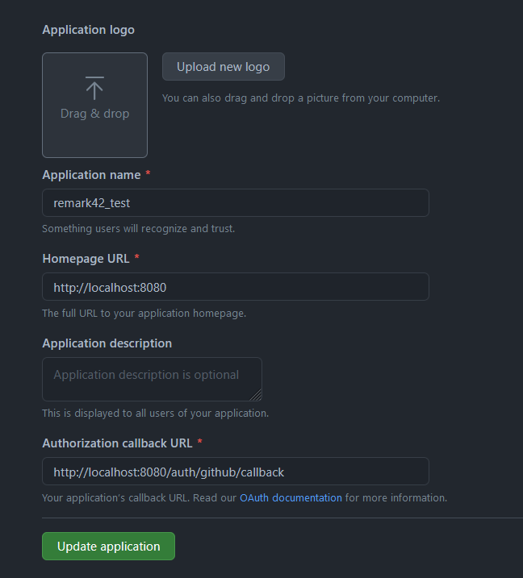
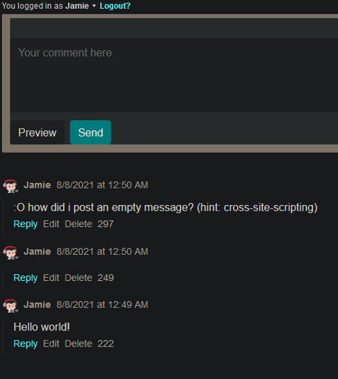

There are many different comment engines nowadays, such as Disqus, which contains ads and costs money just to host it in your website.
But what if I told you that there is an adless alternative that doesn't cost anything?

Remark42 is what you are looking for. It is a self-hosted, lightweight comment engine that can be embedded on any website.

## How to setup Remark42 with Github OAuth

For this tutorial, you will learn how to embed a remark42 instance to a local website. 

Please note that this tutorial will only allow the user to create comments through a Github account, if you would like to add different types of social medias, please refer to https://github.com/umputun/remark42#register-oauth2-providers.

### Requirements

* Docker on your local machine
* A personal Github account

1. Login to Github and create a new "OAuth App" https://github.com/settings/developers.\
   You'll need to fill out a few things, such as the "Homepage URL" and "Authorization callback URL". The "Homepage URL" is the website you want Remark42 to be in. The "Authorization callback URL" contains your website together with "/auth/github/callback" at the end.

   
2. Once the OAuth instance has been created. Go to "Generate a new client secret" and create a client secret. Store the Client ID and Client Secret in your clipboard, you will need this for the next step.
3. Now comes the fun part. Create a new folder where you will generate the remark42 instance. 
   Inside the folder, create a new "docker-compose.yml" file. 
   Important: Add your Client ID and Client secret into this file just under AUTH_GITHUB_CID and AUTH_GITHUB_CSEC.

Inside the docker-compose.yml, type down the following...

```yaml
services:
  remark42:
    image: umputun/remark42:latest
    restart: always
    container_name: "remark42"
    ports:
      - "8080:8080"
    environment:
      - APP_UID=2000 # runs Remark42 app with non-default UID
      - TIME_ZONE=GTC # sets container time to UTC
      - REMARK_URL=http://remark42.localhost:8080 # website url
      - SITE=remarkwow # site ID, same as used for `site_id`, see "Setup on your website"
      - SECRET=abcd-1234 # secret key
      - AUTH_GITHUB_CID={insert Github OAuth Client ID here} # OAuth2 client ID
      - AUTH_GITHUB_CSEC={insert Github OAuth Client Secret here} # OAuth2 client secret
    volumes:
      - ./var:/srv/var # persistent volume to store all Remark42 data
  web:
    build: ./website
    restart: always
    container_name: web
    ports:
      - "8000:80"
    volumes:
      - ./var:/srv/var 
```

This docker-compose file generates two containers: remark42 and web. The Remark42 container contains the self-hosted Remark42 comment engine. The web container will contain a simple .html page that will call the Remark42 instance.

4. Create a new folder "website" and file "index.html". Inside the index.html file, type down the following...

```html
<!DOCTYPE html>
<html lang="en">
  <head>
    <meta charset="UTF-8" />
    <meta http-equiv="X-UA-Compatible" content="IE=edge" />
    <meta name="viewport" content="width=device-width, initial-scale=1.0" />
    <title>Remark42 Test</title>
  </head>
  <body>
    <div id="remark42"></div>
  </body>
  <script>
    var remark_config = {
      host: "http://remark42.localhost:8080",
      site_id: "remarkwow",
      components: ["embed"],
      max_shown_comments: 10,
      theme: "dark",
      locale: "en",
      show_email_subscription: false,
    };
  </script>
  <script>
    !(function (e, n) {
      for (var o = 0; o < e.length; o++) {
        var r = n.createElement("script"),
          c = ".js",
          d = n.head || n.body;
        "noModule" in r ? ((r.type = "module"), (c = ".mjs")) : (r.async = !0),
          (r.defer = !0),
          (r.src = remark_config.host + "/web/" + e[o] + c),
          d.appendChild(r);
      }
    })(remark_config.components || ["embed"], document);
  </script>
</html>
```

This file has a special div element which will be replaced by a comment forum, where you can post comments and read them. The two Javascript code snippets will communicate together with the Remark42 comment engine, which is why it is very important to know, that the host and site_id have to be identical to the remark42 container's host REMARK_URL and SITE (Look at the docker-compose.yml file). 

5. Create a new file called "Dockerfile". Type down the following in the Dockerfile.

```docker
FROM nginx
COPY . /usr/share/nginx/html
```

This is necessary for displaying the index.html page.

6. Go to your terminal and generate the Docker containers. Enter the following commands...

```
docker-compose pull
```

and

```
docker-compose up --build
```

7. Go to http://localhost:8000 and test out Remark42! 

If you want to know if your Remark42 comment engine is running, type down http://localhost:8080/web, a page should then show up with a Remark42 example.



Congratulations on setting it up! Now you know the basics to embedding Remark42 into your website. If you want more additional features, please take a look at their documentation https://github.com/umputun/remark42.

## My experience with Remark42

It's been a fun experience using this technology, it's cool to know that there are comment engines that don't spy on what the users are writing.
Setting it up and playing with it is has been an interesting experience. The documentation for Remark42 can be quite intimidating for a new developer, since there are some tidbits here and there which isn't really clear to understand.
Overall I can definitely recommend using this comment engine. Please know that you might want multiple, powerful servers if you're website has millions of users

<style>
    img[alt=oauth] {
        width: 28rem;
    }
</style>